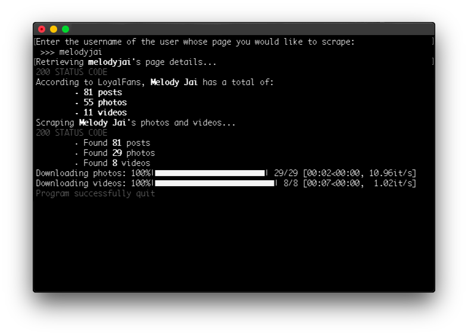

# LoyalFans
Download photos and videos from your favorite creator on LoyalFans

# Requirements
Created with Python 3.9 but 3.8 ought to work as well.

In the command line, run the following (*macOS users and (probably) Linux users should use pip3*):

`pip install -r requirements.txt`

  
FYI

   
  If that didn't work, it's probably because you're not in the same directory as the 'requirements.txt' file.

Keep the `settings.json` and the `loyalfans.py` files in the same directory.

Here comes the slightly complicated part. You need to log in to your LoyalFans account, go to a creator's page, and then open your browser's developer tools. To do this in Chrome on Windows or Linux, hit the following:

`Control + Shift + C`

on macOS:

`Command + Option + C`

Once the developer tools are open, click on the "Network" tab at the top. While your tools are still up, scroll down on the page force that user's posts to load. You should see something that looks like `username?limit=4&page=#`:

Click on that and then scroll down until you see "Request Headers". Copy the text that corresponds to "authorization" (make sure you include the word 'Bearer') and paste it into the corresponding spot in the `settings.json` file. Make sure it's in the quotation marks.

Scroll a little further down in the "Request Headers" and you should also see a field called "User-Agent". Copy the corresponding text and paste it into its corresponding spot in the `settings.json` file as well.

Once that's done, you're good to go.

# Usage
*macOS users and (probably) Linux users should use python3*

To start downloading, run the following in the command line:

`python loyalfans.py`

  
FYI

   
  If that didn't work, it's probably because you're not in the same directory as the 'loyalfans.py' file.

You will then be prompted for a username. Enter the username that corresponds to the page you want to scrape. For example, if you want to scrape loyalfans.com/user, then you would enter `user`.

# Optional Settings
If you are trying to download content from a creator that you're not **subscribed** to (but you're following them), you'll sometimes see that the creator offers a short preview of videos that are only available to *subscribers* and **not** *followers*. The scraper is set by default to scrape those short preview videos. If you would like to skip those videos, open the 'settings.json' file and change the **true** value to **false** next to "download_preview_videos". It *is* case-sensitive.

# Things to Note
1. I have *not* subscribed to a profile on LoyalFans. This means that I'm uncertain if this will catch *all* media (referring to photos/videos that are only available to subscribers). I can, however, confirm that this will catch all media that is accessible to the "public" and to "followers". If you notice that the script isn't catching "subscriber-only" media, please file an [issue](https://github.com/Amenly/LoyalFans/issues/new).
