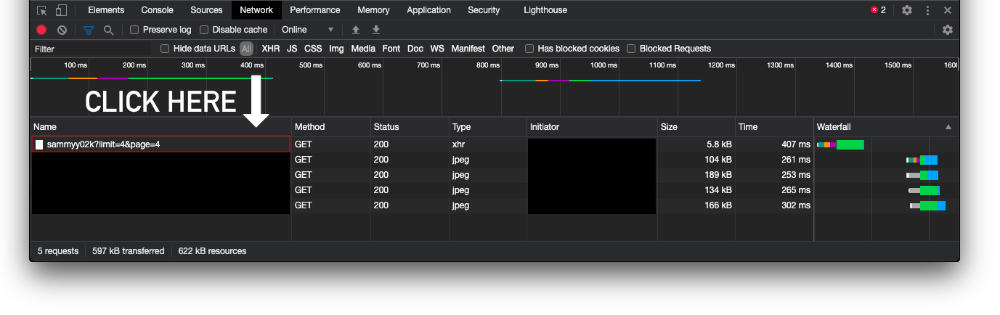
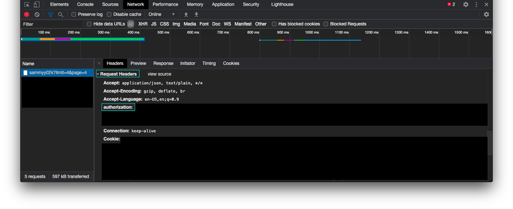

# LoyalFans
Download photos and videos from your favorite creator on LoyalFans

# Requirements
***Created with Python 3.9 but Python 3.8 ought to work as well***

In the command line, run the following:

`pip install -r requirements.txt`

*macOS users and Linux users should use pip3*:

`pip3 install -r requirements.txt`

  
FYI

   
  If that didn't work, it's probably because you're not in the same directory as the 'requirements.txt' file.

Keep the `config.json` and the `loyalfans.py` files in the same directory.

Here comes the slightly complicated part. You need to log in to your LoyalFans account, go to a creator's page, and then open your browser's developer tools. To do this in Chrome on Windows or Linux, hit the following:

`Control + Shift + C`

on macOS:

`Command + Option + C`

Once the developer tools are open, click on the "Network" tab at the top. While the developer tools are still up, scroll down on the user's page to force some of their posts to load. You should then see something that looks like `username?limit=4&page=#`:

Click on that and then scroll down until you see "Request Headers". Copy the text that corresponds to "authorization" (make sure you include the word 'Bearer') and paste it into the corresponding spot in the `config.json` file. Make sure it's in the quotation marks.

Scroll a little further down in the "Request Headers" and you should also see a field called "User-Agent". Copy the corresponding text and paste it into its corresponding spot in the `config.json` file as well.

Once that's done, you're good to go.

# Usage
To start downloading, run the following in the command line:

`python loyalfans.py`

*macOS users and Linux users should use python3*:

`python3 loyalfans.py`

  
FYI

   
  If that didn't work, it's probably because you're not in the same directory as the 'loyalfans.py' file.

You will then be prompted for a username. Enter the username that corresponds to the page you want to scrape. For example, if you want to scrape loyalfans.com/user, then you would enter `user`.

# Options
***The following options can be customized in the*** `config.json` ***file:***

`destination_path`

* Default: `""`
* This will allow you to specify a directory for the content to be stored. If left blank, it will store the content in the current working directory.
* Example: "Users/user/Downloads/secret_folder"

`separate_file_types`

* Default: `true`
* This filters file types (images, videos) into their own subdirectories. Setting this to `false` will store all file types into one single directory.

`download_preview_videos`

* Default: `true`
* You'll sometimes be able to view video previews of videos that are only exclusive to subscribers. If you would like to download those previews, leave this set to `true`

`avoid_duplicates`

* Default: `true`
* This is nothing special; it uses existing file names to determine which files have already been downloaded and which files should be ignored. If you set this to `false`, every time you scrape a profile that you've already scraped, existing files will be overwritten. I may extend this in the future to use hashes rather than file names.

`use_original_dates`

* Default: `true`
* While this is set to `true`, downloaded files will have their 'created date' and 'modified date' reflect the dates when the content creator uploaded them to LoyalFans.

# Things to Note
1. Since the last time I wrote this, I have been able to confirm that this script *will* download content from users you're subscribed to. If you notice that it's not catching certain items, please [file an issue](https://github.com/Amenly/LoyalFans/issues/new).
